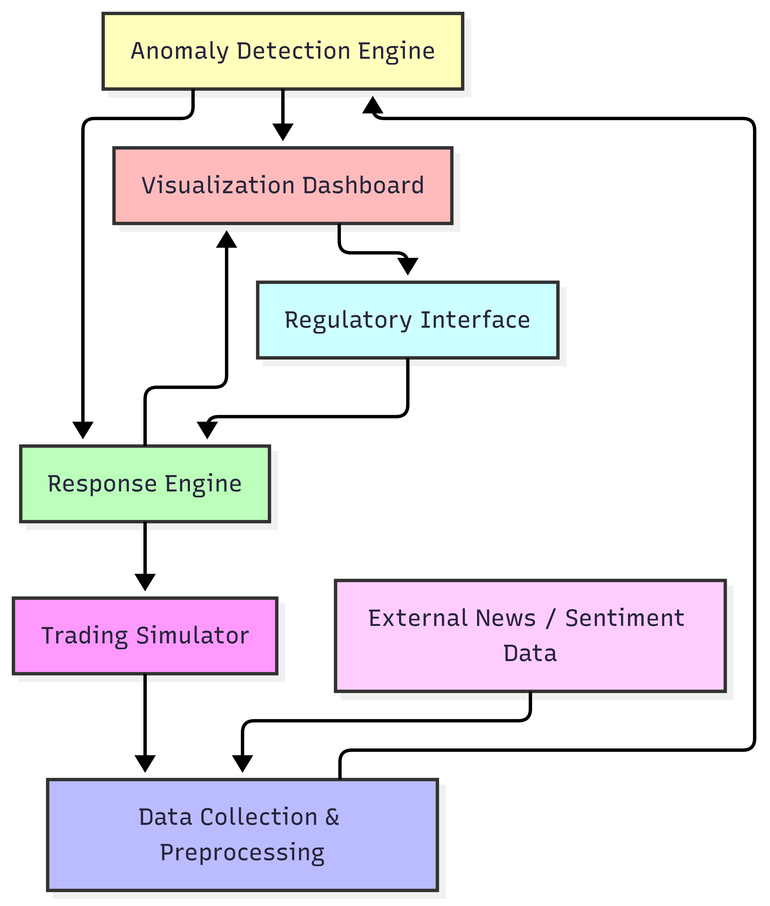

# Financial Immune System MVP



## Motivation
Financial markets are increasingly dominated by algorithmic and high-frequency trading. Small anomalies—whether due to manipulation, faulty strategies, or cascading failures—can have outsized impacts on stability. Inspired by biological immune systems, this project explores how an AI-based monitoring framework can act as a defense mechanism for markets.  

The project is motivated by the analogy between immune systems detecting pathogens and algorithms detecting anomalies in trading behavior. Just as the immune system learns to distinguish between self and non-self, this system learns to separate "normal" trading from potentially harmful anomalies.

## Design
The MVP is designed around an **agentic framework** where each component plays a specialized role but interacts through a central orchestration (`main.py`):

- **TradingSimulatorAgent**: Generates synthetic trading data including normal and anomalous patterns.  
- **DataAgent**: Collects and preprocesses trade data into a structured DataFrame.  
- **AnomalyDetectionAgent**: Detects both volume anomalies (sudden trade spikes) and price anomalies (sudden jumps/drops via z-score). Outputs flags for each.  
- **VisualizationAgent**: Plots trades, overlaying green vs red markers for volume anomalies and unique markers for price anomalies, along with price line visualization.

Configurations (thresholds, parameters) are controlled via `config.yaml` for flexibility.

## MVP
The minimal viable product demonstrates how a financial immune system could function in practice:
1. Simulate a trading environment with normal and anomalous trades.  
2. Detect anomalies in real time (volume & price).  
3. Visualize anomalies clearly in relation to trade activity and price trends.  

This foundation can be extended to:
- Multi-asset environments (stocks, crypto, derivatives).  
- More advanced anomaly detection (LSTM, Isolation Forest).  
- Automated response systems (alerts, trade suspension).  
- Integration with real data sources and sentiment signals.

---

### Usage
1. Install dependencies:  
   ```bash
   pip install -r requirements.txt
   ```

2. Run the main pipeline:  
   ```bash
   python main.py
   ```

3. A matplotlib window will open showing trading activity with anomalies highlighted.

